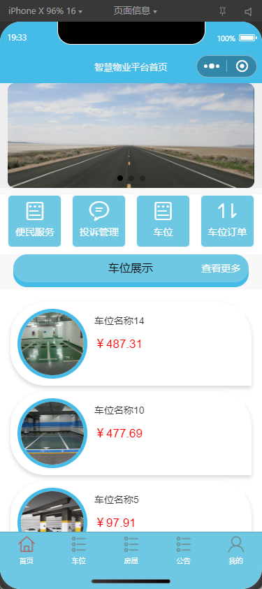
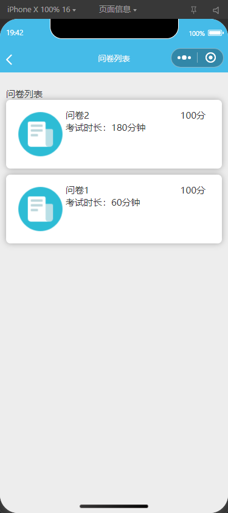
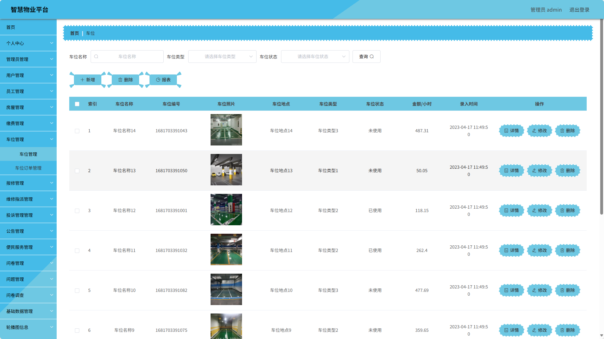

# 智慧物业管理小程序(文末免费领取☟)
> 
#### 介绍
智慧物业管理小程序(Java_SpringBoot_微信小程序)
有BUG可留言加微

#### 软件架构
Java + SpringBoot + 微信小程序 + Mybatis + Mysql

#### 项目功能说明

> + 系统有管理员、员工、用户角色
> + 登录注册
> + 个人中心
> + 管理员管理、用户管理、员工管理
> + 房屋管理
> + 缴费管理
> + 车位管理
> + 报修管理
> + 维修指派管理
> + 投诉管理
> + 公告管理
> + 便民服务管理
> + 问卷管理、问题管理、问卷调查
> + 基础数据管理：报修类型管理、车位类型管理、房屋类型管理、公告类型管理、缴费类型管理、科目管理
> + 轮播图管理

### 部分功能演示

### 环境需求(可免费提供)
- idea/eclipse、jdk-1.8、maven-3.8.6、mysql、node.js等

## 有项目修改、安装调试需求 请联系以下

## 获取资源扫☝☝☝

